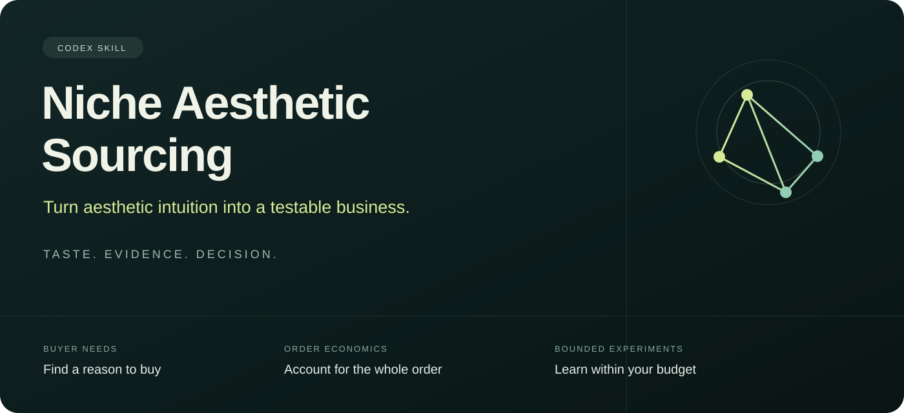

# Niche Aesthetic Sourcing



**Turn aesthetic intuition into a testable business.**

[中文](README.md) · [Skill](skills/niche-aesthetic-sourcing/SKILL.md) · [Releases](https://github.com/Fan-dev-sktch/niche-aesthetic-sourcing/releases/latest)

A Codex skill for evaluating niche aesthetic and hobby products for overseas consumer retail. Bring your design taste, sourcing capabilities and constraints; get the 1–3 most useful candidates, traceable evidence, explicit unknowns, and a focused next experiment.

It follows buyer needs through alternatives, full order economics, seller eligibility and fulfillment to a bounded sales test. Current skill instructions and detailed references are in Chinese; this page is an English overview.

## What it checks

| Question | Evidence required |
|---|---|
| Demand | Attributable purchases in a defined target market and period |
| Aesthetic premium | Matched transaction prices or a controlled paid experiment |
| Competitive gap | Specific unmet needs, direct substitutes and new entrants |
| Order economics | Shipping, platform/payment fees, tax responsibility, acquisition, labor and refunds |
| Rights and channel | Product/marketing rights and the actual seller's eligibility |
| Fulfillment | Real samples, fit, quality, delivery and returns |

Each check is **pass / unknown / fail**. Listing prices, likes, reviews and shop totals do not become SKU sales. Unknown costs stay unknown.

For markets with meaningful scale and growth, first check comparable actual retail sales and the absolute spending increment. Separate units, buyers, pricing and channel migration. Parent-market growth qualifies a research direction; it does not establish accessory demand, a design premium or profit. A single creator's crowdfunding campaign validates that case rather than the market.

The cash guard covers the whole trial: inventory and quoted MOQ, samples/setup, acquisition, fulfillment reserves, fees/taxes/refunds, and other commitments. It checks current user budgets and uses a conservative no-revenue, no-stock-recovery assumption.

## Install

Ask Codex:

> Use skill-installer to install https://github.com/Fan-dev-sktch/niche-aesthetic-sourcing/tree/main/skills/niche-aesthetic-sourcing.

Or extract the [release package](https://github.com/Fan-dev-sktch/niche-aesthetic-sourcing/releases/latest) into `~/.codex/skills/`. Preserve an existing same-name installation before updating. The skill becomes available on the next turn.

## Try it

> Use $niche-aesthetic-sourcing to research original stationery for French buyers. I can illustrate, have a €300 budget, and want no licensed-character products. Give up to three candidates, counterevidence, and the most useful next check.

> Use $niche-aesthetic-sourcing to evaluate this product: [URL]. Review the actual images, specifications, delivered price and buyer feedback. Keep unverified claims unknown.

> Use $niche-aesthetic-sourcing to review my quotes, sample notes and fee sheet: [materials]. Check full order costs and total trial cash commitments; propose purchase metrics and stop conditions.

## Local tools and checks

The optional Python tools use only the standard library. They read local JSON and print results, with no network calls or file writes. The 12 local behavioral tests pass on Python 3.13. Other runtime versions have not been verified in this release.

```bash
python skills/niche-aesthetic-sourcing/scripts/check_batch.py skills/niche-aesthetic-sourcing/assets/discovery-example.json
python skills/niche-aesthetic-sourcing/scripts/analyze_trial.py examples/zero-orders.json
python -m unittest discover -s tests -v
```

Examples and test fixtures are synthetic. Search and page-reading tools are provided by your environment; the skill does not connect marketplace accounts or purchase subscriptions for you.

## Current validation

Local tool behavior, budget constraints and public-case reasoning have been checked. Commercial results have not been established through this project's own transactions, formal quotes, physical samples or realized profit. The scripts validate declarations and arithmetic, not source truth, legal rights, causal aesthetic effects or future profitability.

Research does not automatically authorize supplier contact, buying, account creation, listing or advertising. Actual actions follow the user's specific authorization.

Bring dated evidence and reproducible findings to [Issues](https://github.com/Fan-dev-sktch/niche-aesthetic-sourcing/issues).
